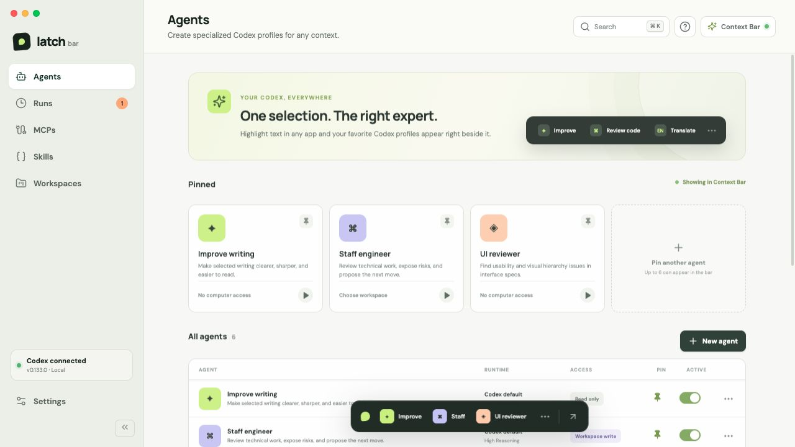
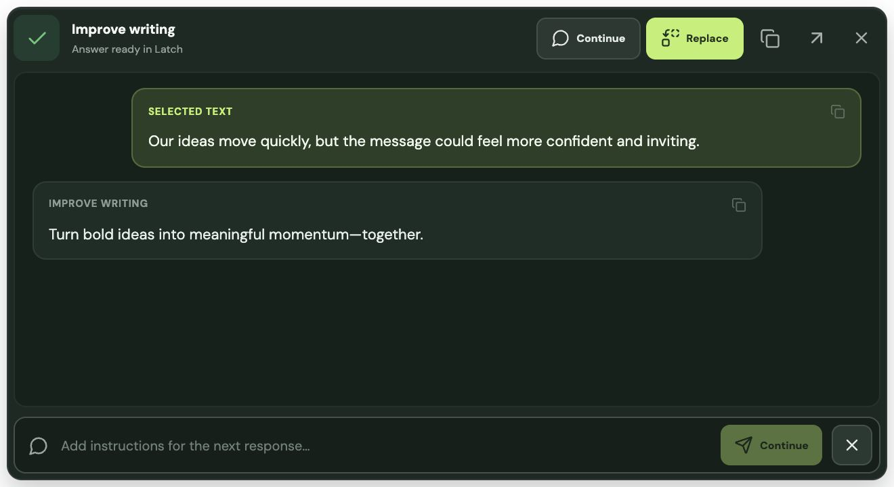

# Latch Bar

https://github.com/user-attachments/assets/448b1336-c6d1-4ff6-a669-37a525eb525d

<p align="center">
  <strong>Bring the right Codex agent to any text selection on your Mac.</strong><br>
  Select context, choose a permission-scoped agent, and inspect or apply the streamed result without breaking your flow.
</p>

<p align="center">
  <a href="https://github.com/joacota2/latch-bar/releases/latest/download/Latch-Bar.dmg">
    
  </a>
  
</p>

<p align="center"><sub>The notarized macOS download is universal for Apple silicon and Intel. Windows support is planned.</sub></p>

## From selection to result

<p align="center">
  
</p>

<p align="center"><sub>Configure reusable agents in Studio, then summon them from the non-activating Context Bar in any supported app.</sub></p>

<table>
  <tr>
    <td width="33%"><strong>1. Select anywhere</strong><br><sub>Highlight editable or read-only text in native apps, browsers, documents, and full-screen Spaces.</sub></td>
    <td width="33%"><strong>2. Choose the right agent</strong><br><sub>Route the selection to a pinned Codex agent with its own model, workspace, tools, and permission scope.</sub></td>
    <td width="33%"><strong>3. Review or replace</strong><br><sub>Inspect the streamed response beside the source and apply it only when the target and agent both allow replacement.</sub></td>
  </tr>
</table>

The five default agents are **Improve writing**, **Translate to English**, **Explain simply**, **Draft a reply**, and **Summarize**. Improve writing, Summarize, and Explain simply are pinned initially; all five work on selected text without a workspace or integrations.

### Keep the conversation in context

<p align="center">
  
</p>

<p align="center"><sub>The production Context Bar keeps the selected text, response, actions, and follow-up composer inside the source app.</sub></p>

## Product overview

- A polished Codex Studio with Agents, Runs, MCPs, Skills, Workspaces, and Settings.
- Full agent CRUD and configuration for prompt, runtime, sandbox, approvals, workspace, context, tools, Skills, and output.
- A separate non-activating, always-on-top Context Bar window driven by editable and read-only macOS text selections, including website content and full-screen Spaces.
- Native Accessibility capture with a gesture-gated clipboard fallback for custom editors, secure-field exclusion, bounds positioning, per-selection replacement capabilities, direct replacement, and guarded clipboard-paste replacement.
- Persistent local agents, settings, and real run history (no seeded or simulated runs).
- A Tauri 2 shell with app-server-backed model, configuration, account, MCP, Skill, permission, capability, feature, and recent-workspace discovery, plus streamed runs, approvals, cancellation, and shutdown.
- A platform-adapter boundary with the Windows UI Automation module isolated for the next implementation.

The browser build is Studio-only. Selection capture and Codex execution intentionally fail closed outside the Tauri desktop shell; there is no simulated runtime adapter.

## Run it

Requires Node.js 22.12+ (Node 24 is also supported) and a Rust toolchain for the native app.

```bash
npm install
npm run dev
```

Open `http://127.0.0.1:1420`.

Production web build and tests:

```bash
npm run build
npm test
```

Native development requires a Rust toolchain:

```bash
rustup update stable
npm run tauri dev
```

On first launch, open **Settings → Selection → Enable Accessibility** and allow Latch Bar under **System Settings → Privacy & Security → Accessibility**. Latch checks the permission silently on startup and prompts only after an explicit enable action. Select at least three characters in another application; the native Context Bar appears beside the selected range, including read-only website or document text when the source application exposes it. When a custom editor does not expose its selected text through Accessibility, Latch can issue a targeted Command-C after a selection gesture. It snapshots the existing pasteboard first and restores it immediately only if no newer clipboard owner has written. Choosing an agent starts a real `codex app-server` turn using the existing Codex login. **Replace** is enabled only when both the source control and the selected agent permit replacement. Direct Accessibility writes and guarded Command-V fallback both revalidate the original selection before changing it. Latch distinguishes a verified edit from a dispatched edit the source app cannot confirm; an unverified edit keeps the answer visible and prevents a second automatic dispatch. When no safe replacement contract is available, copy the answer and paste it manually.

macOS records privacy permissions against the app's code-signing identity. Ad-hoc builds are identified by a code hash, so rebuilding them invalidates an apparently enabled Accessibility entry. Persistent installed builds must therefore use an Apple signing identity:

```bash
APPLE_SIGNING_IDENTITY="Developer ID Application: Example (TEAMID)" npm run tauri build
```

The release bundle hook rejects unsigned macOS bundles. Use `npm run tauri build -- --no-bundle` for a compile-only check. `tauri dev` remains ad-hoc; after its native executable changes, macOS may require removing the old Accessibility entry and granting the rebuilt development binary again.

## Releases

Installed macOS releases check for updates automatically and offer **Update and restart** under **Settings → General → Updates**. Downloads happen only when requested. Active agents and unsaved profile editing block installation. Releases are private: install GitHub CLI (`gh`) and run `gh auth login --hostname github.com` with an account that can read this repository. Latch uses that existing login to fetch the release manifest and archive through GitHub's API; it never bundles or persists a token, and archives must still pass updater signature verification. Versions with the old unauthenticated updater must install the first release containing this fix manually.

Pull requests should use Conventional Commit titles such as `fix: ...`, `feat: ...`, or `feat!: ...` and should be squash-merged. Release Please keeps an automated release pull request up to date with the next SemVer version and changelog. Merging that release pull request creates a draft release and tag; GitHub Actions then builds one universal Intel and Apple Silicon DMG, signs it with Developer ID, notarizes and staples it, uploads its checksum, and publishes the release.

If a release build fails after the draft and tag were created, rerun the failed job. The release workflow can also be started manually with that existing draft tag. See [CONTRIBUTING.md](CONTRIBUTING.md) for the contribution convention and [docs/RELEASING.md](docs/RELEASING.md) for the one-time Apple and GitHub setup.

## Architecture

```text
React Studio                 Native Context Bar window
      │                                │
      └──────────── Tauri commands ────┘
                       │
                       ├── PlatformAdapter
                       │      ├── macOS AXUIElement (implemented)
                       │      └── Windows UI Automation (next)
                       ├── Codex app-server discovery client
                       │      ├── model / config / account
                       │      ├── MCP / Skill / permissions
                       │      └── capabilities / threads
                       └── Codex app-server manager
                              ├── thread/start
                              ├── turn/start / interrupt
                              ├── streamed notifications
                              └── approval responses
```

The runtime protocol follows the current [Codex app-server documentation](https://learn.chatgpt.com/docs/app-server.md). Codex is the source of truth for runtime catalogs and effective settings; Latch keeps only its own agent choices and product preferences. MCP credentials remain owned by Codex, and Skills remain in Codex-discovered user, repository, system, or administrator locations. Named CLI profiles are discovered from the active Codex home and legacy config metadata because app-server does not expose a profile-list method.

## Security decisions

- Profiles default to read-only.
- Full access always shows a persistent warning.
- MCP credentials are never copied; profiles store only server IDs.
- Selected text is escaped and placed in a delimited data block with explicit runtime rules.
- Selected source text is not stored by default.
- Clipboard capture is attempted only after a selection-shaped gesture; the previous pasteboard is restored immediately when its ownership generation is still unchanged.
- Read-only and unknown selection targets fail closed: Replace stays disabled, and the native command independently rejects unsupported or stale targets.
- Context Bar clicks do not order Studio forward; only the explicit redirect opens and focuses Studio. The bar is clamped to the visible work area as it opens and expands.
- Screenshot context is off by default.
- Password managers and secure fields are excluded from contextual capture.

## Audit and compatibility

The [implementation audit](docs/IMPLEMENTATION_AUDIT.md) records the selection, replacement, workspace, privacy, and runtime findings, their fixes, and the signed-build acceptance matrix. Workspaces supports saved local folders alongside Codex history, with Finder, copy-path, and agent-creation actions. Unsupported desktop features are shown as unavailable.

Desktop data is migrated from the legacy webview storage to `latch-state.json` in Tauri's application data directory. Studio and the Context Bar share atomic, revision-checked writes. Clear data resets both windows, stops active runtimes, and rejects pending writes from the old session. Runs interrupted by an app restart appear as cancelled. Browser preview saves require Web Locks support.

Local history retains at most 200 runs. Disabling it clears Latch's local history; Codex manages its own thread history independently.

## License

Copyright 2026 Joaquin Gomez and contributors.

Latch Bar is licensed under the [Apache License, Version 2.0](LICENSE). See [NOTICE](NOTICE) and [third-party licenses and notices](THIRD_PARTY_NOTICES.txt) for attribution. Third-party dependencies and assets retain their respective licenses and notices; the app includes the complete sources of its MPL components in `Contents/Resources/third-party/sources`.

See the [attribution maintenance guide](docs/THIRD_PARTY.md), [code and asset provenance](docs/PROVENANCE.md), and [brand policy for forks](docs/BRAND.md).
